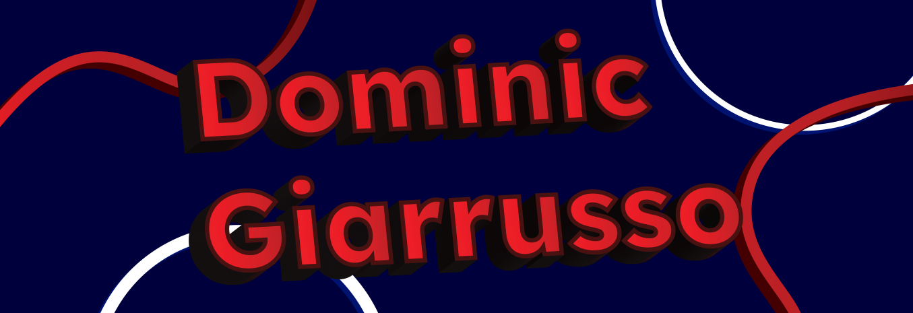

# Hey! I'm Dominic Giarrusso

I developed a passion for programming while in college studying game development, with my programming foundations rooted in C/C++ and C#. This all came together in my capstone project, [**_Awakened_**](https://domgiarrusso.itch.io/awakened), built with Unreal Engine 5. Since graduating, I've broadened my horizons to software and web development, having learned Python, JavaScript, and more. I also don't see myself stopping anytime soon either. My journey is far from over, and I'm excited to showcase my skills and start my full-time career.

I will say the barrier to entry for a web project compared to a game project is so much lower and much more enjoyable to get something out there quickly that people can use.

You can find below more of my projects, check them out!

### Check out my

-   📄 [**Portfolio**](https://www.dominicgiarrusso.com/)
-   🔗 [**LinkedIn**](https://www.linkedin.com/in/domgiarrusso/)
